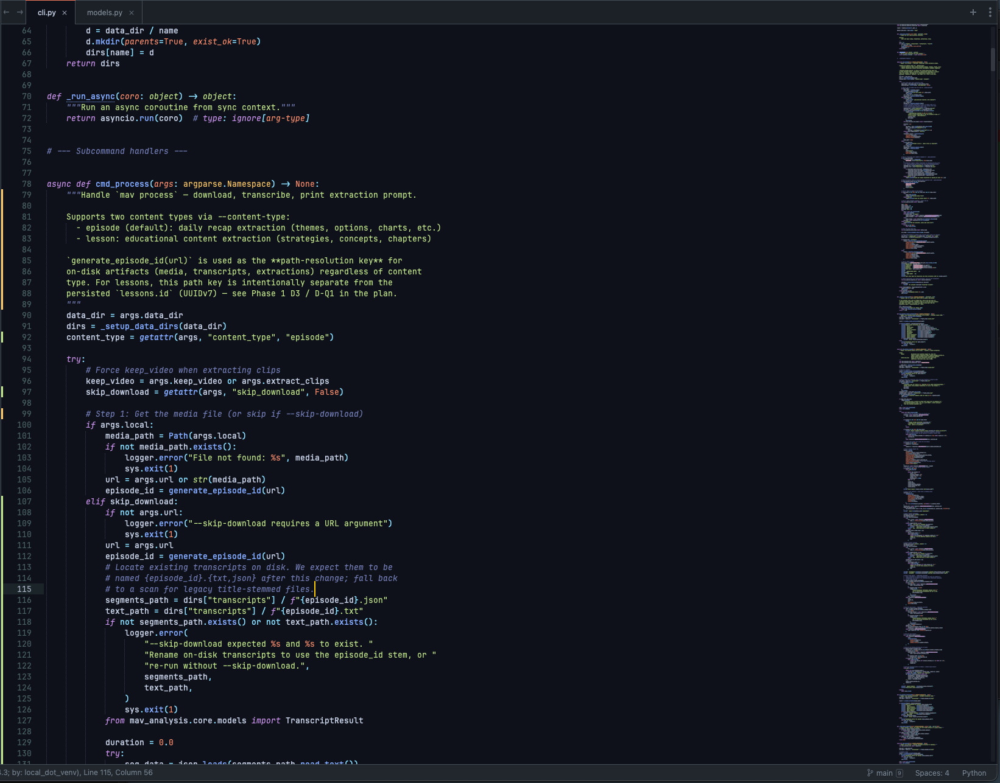

# Material Deep Ocean

A Sublime Text color scheme ported from the Material Theme UI "Deep Ocean" variant.

Deep navy background with vibrant accents — designed for long focused sessions.

## Preview



## Installation

### Package Control (recommended)

Once accepted into the default channel:

1. Open the command palette (`Cmd/Ctrl+Shift+P`)
2. Run `Package Control: Install Package`
3. Search for `MaterialDeepOcean` and install

### Manual

1. Clone this repo into your Sublime Text `Packages/User/` directory:
   ```sh
   git clone https://github.com/luinstra/material-deep-ocean-sublime.git \
     "$HOME/Library/Application Support/Sublime Text/Packages/User/MaterialDeepOcean"
   ```
   (Adjust the path for your OS — `~/.config/sublime-text/Packages/User/` on Linux, `%APPDATA%\Sublime Text\Packages\User\` on Windows.)
2. In Sublime: `Preferences` → `Select Color Scheme` → `Material Deep Ocean`

## Credits

Color palette derived from the Material Theme UI "Deep Ocean" variant. This is an unofficial Sublime Text port.

## License

[MIT](LICENSE)
